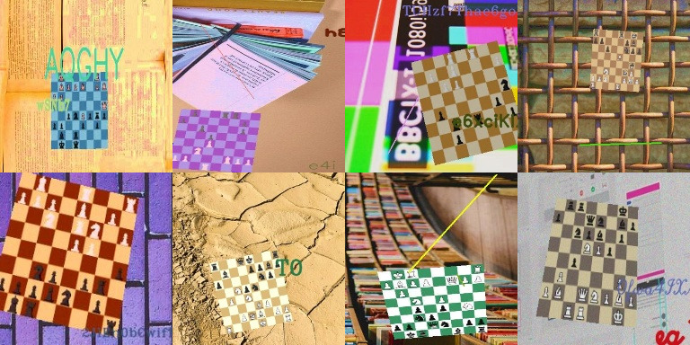
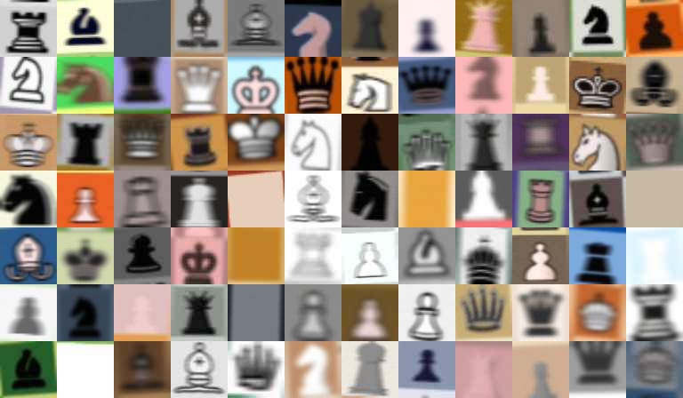

# ♟️ ChessML

ChessML is a Python package containing a collection of modules and scripts for advanced chess analysis.

https://github.com/arlegotin/chessml/assets/1470560/129bf752-50b7-4754-b2da-39946916c909

This toolkit provides a variety of features, including board detection, piece recognition, and position encoding/decoding using Variational Autoencoders (VAEs), among others.

ChessML is built on top of [PyTorch](https://pytorch.org/) and [Lightning](https://lightning.ai/docs/pytorch/stable/). It also offers access to pretrained models and datasets.

## 📚 Table of contents
- [Getting started](#-getting-started)
  - [Installation](#-installation)
  - [Configuration](#-configuration)
- [Models](#-models)
  - [Pretrained models](#-pretrained-models)
  - [Training & inference](#-training-inference)
    - [BoardDetector](#-board-detector)
    - [PieceClassifier](#-piece-classifier)
    - [MetaPredictor](#-meta-predictor)
  - [Retrieving FEN from image](#-retrieving-fen)
- [Datasets & assets](#-datasets-assets)
  - [Pregenerated datasets & assets](#-pregenerated-datasets-assets)
  - [Generating datasets](#-generating-datasets)
  - [Dynamic datasets](#-dynamic-datasets)
- [Contribution](#-contribution)
- [Acknowledgements](#-acknowledgements)

## 🚀 Getting started
<a name="-getting-started"></a>

### Installation
<a name="-installation"></a>

ChessML uses [Poetry](https://python-poetry.org/) for managing dependencies. Ensure you have Python version 3.11 or higher.

To set up the project, run the following command:
```bash
poetry install
```

Activate the Poetry environment with:
```bash
poetry shell
```

As a sanity check run a test script, which will print out `./config` content:
```bash
python scripts/sanity_check.py
```

>Tip: All script entry points are located in the `./scripts` directory. Use `-h` for guidance on how to use these scripts

Now, you're all set to go!

### Configuration
<a name="-configuration"></a>

Configuration is managed through `./config.yaml`, where you can define your hardware specifications, paths to datasets, logging settings, and more.

By default, the configuration is set for a computer equipped with a single GPU and running `Ubuntu 20.04.2 LTS`.

You don’t need to make any changes unless you are using a different OS or hardware setup, or you modify the project's file structure.

## ⚗️ Models
<a name="-models"></a>

### Pretrained models
<a name="-pretrained-models"></a>

Download and unzip them in the `./checkpoints` directory to use:

| Class | Description | Size (unzipped) | Download |
| - | - | - | - |
| BoardDetector based on [MobileViTV2](https://huggingface.co/timm/mobilevitv2_200.cvnets_in1k) | Processes an image to predict the corners of the chessboard | 224.5MB | [.ckpt](https://drive.google.com/file/d/10T7DVnGI6Qh5QEZdBjU09SpYSPgXTiMV/view?usp=sharing) |
| PieceClassifier based on [EfficientNetV2](https://huggingface.co/timm/efficientnetv2_rw_s.ra2_in1k) | Analyzes an image to identify which chess piece it depicts, including empty squares | 255MB | [.ckpt](https://drive.google.com/file/d/1zteWazd3e1RErtjjSrWsvzm_9_LxXrIo/view?usp=drive_link) |
| MetaPredictor (CNN) | Analyzes the position on the board and predicts castling rights, whose turn it is, and whether the board is viewed from White's or Black's perspective. | 5.7MB | [.ckpt](https://drive.google.com/file/d/1ovmG0ZRKD29SG25iARTNWbxOCZdMAv5m/view?usp=drive_link) |

### Training & inference
<a name="-training-inference"></a>

>Tip: All training scripts are optimized for the `Quadro RTX 8000`. You can modify hyperparameters via CLI arguments.

>Tip: Monitor metrics using TensorBoard by running the command `tensorboard --logdir=logs/tensorboard/lightning_logs`.

>Tip: If you're using `IterableDatasets`, please ignore the PyTorch warning suggesting to increase `num_workers`.

#### BoardDetector
<a name="-board-detector"></a>

`BoardDetector` is a `LightningModule` that predicts the coordinates of chessboard corners from any image. It utilizes a pretrained model, such as [MobileViTV2](https://huggingface.co/timm/mobilevitv2_200.cvnets_in1k), as its backbone and outputs 8 values: relative coordinates of four 2D points.

During training, it utilizes the `AugmentedBoardsImages` dataset. To begin training, run the following script:
```bash
python scripts/train/train_board_detector.py 
```

Dataset example:



To inference pretrained or newly-trained model:
```python
from chessml.models.lightning.board_detector_model import BoardDetector
from chessml.models.torch.vision_model_adapter import MobileViTV2FPN
from chessml.data.images.picture import Picture

model = BoardDetector.load_from_checkpoint(
    "./checkpoints/bd-MobileViTV2FPN-v1.ckpt",
    base_model_class=MobileViTV2FPN,
)

model.eval()

source = Picture("./image.jpeg")

# For vanilla output:
coords = model.predict_coords(source)

# For an unskewed board image (returns None if no board is found):
extracted_board_image = model.extract_board_image(source)

# Marks the board on the original image:
image_with_marked_board = model.mark_board_on_image(source)
```

#### PieceClassifier
<a name="-piece-classifier"></a>

`PieceClassifier` is a `LightningModule` that predicts the chess piece from an image. It uses a pretrained model, such as [EfficientNetV2](https://huggingface.co/timm/efficientnetv2_rw_s.ra2_in1k), as its backbone and outputs an index corresponding to the piece class in `PIECE_CLASSES`.

During training, it utilizes the `AugmentedPiecesImages` dataset. To begin training, run the following script:
```bash
python scripts/train/train_piece_classifier.py 
```

Dataset example:



To inference pretrained or newly-trained model:
```python
from chessml.models.torch.vision_model_adapter import EfficientNetV2Classifier
from chessml.models.lightning.piece_classifier_model import PieceClassifier
from chessml.data.assets import INVERTED_PIECE_CLASSES
from chessml.data.images.picture import Picture

model = PieceClassifier.load_from_checkpoint(
    "./checkpoints/pc-EfficientNetV2Classifier-v1.ckpt",
    base_model_class=EfficientNetV2Classifier,
)

model.eval()

source = Picture("./image.jpeg")
class_index = model.classify_piece(source)

# Will be one of the following:
# P, N, B, Q, K, p, n, b, q, k, or None for an empty square
piece_name = INVERTED_PIECE_CLASSES[class_index]

# Or a batch:
sources = [Picture(f"./{i}.jpeg") for i in range(64)]
class_indexes = model.classify_pieces(sources)
```

#### MetaPredictor
<a name="-meta-predictor"></a>

`MetaPredictor` is a `LightningModule` that predicts castling rights, whose turn it is to move, and whether the position is viewed from White's perspective or Black's, based on the pieces' positions.

```bash
python scripts/train/train_meta_predictor.py 
```

To inference pretrained or newly-trained model:
```python
from chessml.models.lightning.meta_predictor_model import MetaPredictor
from chessml.data.boards.board_representation import OnlyPieces
from chess import Board

representation = OnlyPieces()

meta_predictor = MetaPredictor.load_from_checkpoint(
    "./checkpoints/mp-MetaPredictor-v1.ckpt",
    input_shape=representation.shape,
)

model.eval()

# Position for which we’d like to predict metadata:
fen_position = "2Q5/4kp2/6pp/3p1r2/5P2/7P/6P1/6K1"

# Note: turn and castling rights are not important:
board = Board()
board.set_fen(f"{fen_position} w - - 0 1")

(
    white_kingside_castling,
    white_queenside_castling,
    black_kingside_castling,
    black_queenside_castling,
    white_turn,
    flipped,
) = model.predict(representation(board))

castling = "".join([
    "K" if white_kingside_castling else "",
    "Q" if white_queenside_castling else "",
    "k" if black_kingside_castling else "",
    "q" if black_queenside_castling else "",
]) or "-"

turn = "w" if white_turn else "b"

fen = f"{fen_position} {turn} {castling} - 0 1"
```

### Retrieving FEN from image
<a name="-retrieving-fen"></a>
The most useful scenario is when you have an image and want to extract the final FEN from it. To achieve this, use `BoardRecognitionHelper` and `RecognitionResult`:

```python
from chessml.models.torch.vision_model_adapter import MobileViTV2FPN, EfficientNetV2Classifier
from chessml.models.utils.board_recognition_helper import BoardRecognitionHelper
from chessml.models.lightning.piece_classifier_model import PieceClassifier
from chessml.models.lightning.board_detector_model import BoardDetector
from chessml.models.lightning.meta_predictor_model import MetaPredictor
from chessml.data.boards.board_representation import OnlyPieces
from chessml.data.images.picture import Picture

board_detector = BoardDetector.load_from_checkpoint(...)
board_detector.eval()

piece_classifier = PieceClassifier.load_from_checkpoint(...)
piece_classifier.eval()

meta_predictor = MetaPredictor.load_from_checkpoint(...)
meta_predictor.eval()

helper = BoardRecognitionHelper(
    board_detector=board_detector,
    piece_classifier=piece_classifier,
    meta_predictor=meta_predictor,
)

source = Picture("./image.jpeg")

result = helper.recognize(source)

fen = result.get_fen()
viewed_from_whites_perspective = not result.flipped
```

## 📦 Datasets & assets
<a name="-datasets-assets"></a>

### Pregenerated datasets & assets
<a name="-pregenerated-datasets-assets"></a>

> Tip: you can train models using only the "Unique FENs" file. For more information, see the "Dynamic datasets" section below.

Download and unzip them into the `./datasets` or `./assets` directory for use:

| Name | Description | Format | Size (unzipped) | Download |
| - | - | - | - | - |
| Unique FENs (dataset) | A list of 22M+ unique valid FENs used to produce other datasets | Zipped TXT | 1.1GB | [Google Drive](https://drive.google.com/file/d/1uDeD9lupAi7daJm6K5YAao7WYvRdH0Ld/view?usp=drive_link) |
| Unaltered chessboard images (dataset) | Unaltered chessboard images showcasing various piece sets and board themes, complete with corresponding metadata for generating augmented images. | ZIP containing 512x512 JPEGs and TXTs | - | *Coming soon* |
| Augmented chessboard images (dataset) | Images of chessboards with various piece sets and themes, distorted and embedded into diverse backgrounds with assorted degradations. Includes corresponding metadata for training the BoardDetector. | ZIP containing 512x512 JPEGs and TXTs | - | *Coming soon* |
| Augmented pieces (dataset) | Augmented pieces images from various sets and square colors, distorted and with assorted degradations, accompanied by corresponding metadata used to train the PiecesClassifier. | ZIP containing 128x128 JPEGs and TXTs | - | *Coming soon* |
| Piece sets (asset) | Open-source piece sets used to generate chessboard and pieces datasets | ZIP containing SVGs | - | *Coming soon* |
| Backgrounds (asset) | Open-source images used to generate augmented chessboard images | ZIP containing JPEGs | - | *Coming soon* |

### Generating datasets
<a name="-generating-datasets"></a>

Begin by downloading PGN files, which will serve as the source for all other datasets:
```bash
python scripts/data/download_pgns.py
```

Next, use the downloaded PGNs to generate a file containing unique FENs:
```bash
python scripts/data/export_unique_fens.py
```

For now, you are good to go with using dynamic datasets (refer to the section below).

Scripts for generating additional datasets will be available soon.

### Dynamic datasets
<a name="-dynamic-datasets"></a>

The datasets used to train the `BoardDetector`, `PieceClassifier`, and other models are based on [IterableDatasets](https://pytorch.org/docs/stable/data.html#torch.utils.data.IterableDataset). 

These generate data – either images or board representations – during runtime using only FENs. 

Although this method is slower than using pre-generated datasets, it allows for the creation of unlimited amounts of data with diverse augmentations from just the original FENs.

### Auxiliary data classes
#### Picture
Serves as an interface for exchanging images between ChessML modules, allowing to avoid unnecessary transformations and excessive code:
```python
from chessml.data.images.picture import Picture
from pathlib import Path
from PIL import Image
import random
import cv2

# Read from any source:
from_str_path = Picture("./image.jpeg")
from_path = Picture(Path("./image.jpeg"))
from_pil = Picture(Image.open("./image.jpeg"))
from_cv2 = Picture(cv2.imread("./image.jpeg"))

# Pick any, as they all have the same interface:
any_of_them = random.choice([
  from_str_path,
  from_path,
  from_pil,
  from_cv2,
])

# Use as PIL or OpenCV:
cv2_image = any_of_them.cv2
pil_image = any_of_them.pil
```

## 👷 Contribution
<a name="-contribution"></a>

This repository is actively maintained and frequently updated, which can sometimes lead to compatibility issues.

If you encounter any problems or have feature requests, please don’t hesitate to open an issue.

Pull requests are warmly welcomed. To ensure consistency, please format your code using [Black](https://pypi.org/project/black/) before submitting.

## ✨ Acknowledgements
<a name="-acknowledgements"></a>

I would like to highlight certain projects that were extremely helpful during development:

- [python-chess](https://github.com/niklasf/python-chess) by [niklasf](https://github.com/niklasf)
- [Fen-To-Board-Image](https://github.com/ReedKrawiec/Fen-To-Board-Image) by [ReedKrawiec](https://github.com/ReedKrawiec)
- [PGN Mentor](https://www.pgnmentor.com/) as a data source
- [Lichess piece sets](https://github.com/lichess-org/lila/blob/master/COPYING.md) for generating datasets
- My cats, who help maintain my peace of mind:

https://github.com/arlegotin/chessml/assets/1470560/2da615c4-2899-43fb-8134-ec70d4fe8c5e


