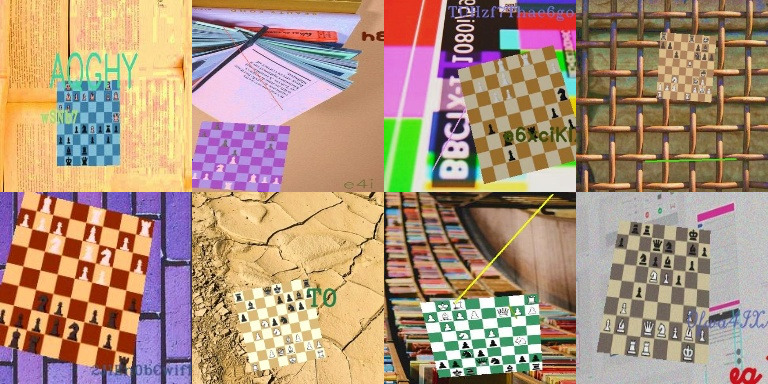
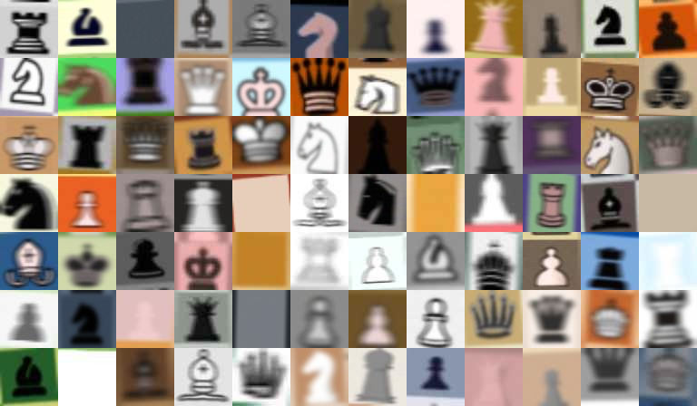

# ♟️ ChessML

ChessML is a Python package containing a collection of modules and scripts for advanced chess analysis.

https://github.com/arlegotin/chessml/assets/1470560/129bf752-50b7-4754-b2da-39946916c909

This toolkit provides a variety of features, including board detection and piece recognition, among others.

ChessML is built on top of [PyTorch](https://pytorch.org/) and [Lightning](https://lightning.ai/docs/pytorch/stable/). It also offers access to pretrained models and datasets.

## 📚 Table of contents
- [Getting started](#-getting-started)
  - [Installation](#-installation)
  - [Configuration](#-configuration)
- [Models](#-models)
  - [Pretrained models](#-pretrained-models)
  - [Training & inference](#-training-inference)
    - [BoardDetector](#-board-detector)
    - [PieceClassifier](#-piece-classifier)
    - [MetaPredictor](#-meta-predictor)
  - [Retrieving FEN from image](#-retrieving-fen)
- [Datasets & assets](#-datasets-assets)
  - [Pregenerated datasets & assets](#-pregenerated-datasets-assets)
  - [Generating datasets](#-generating-datasets)
  - [Dynamic datasets](#-dynamic-datasets)
- [Contribution](#-contribution)
- [Acknowledgements](#-acknowledgements)

## 🚀 Getting started
<a name="-getting-started"></a>

### Installation
<a name="-installation"></a>

ChessML uses Python 3.14.6 and [uv](https://docs.astral.sh/uv/) 0.11.28 or newer in the 0.11 series. Install uv using its [official installation instructions](https://docs.astral.sh/uv/getting-started/installation/); the tracked `.python-version` lets uv select the project interpreter.

Sync the exact locked environment:
```bash
uv sync --locked
```

No shell activation is required. uv creates a local `.venv` and runs project commands inside it with `uv run`.

Before running ChessML, ensure the ignored `./config.local.yaml` exists. If you do not need local overrides, create it with the YAML content `{}`.

As a sanity check, print the merged configuration:
```bash
uv run python scripts/sanity_check.py
```

> Tip: All script entry points are located in the `./scripts` directory. Use `-h` for guidance on how to use these scripts.

### Configuration
<a name="-configuration"></a>

Configuration is managed through `./config.yaml`, where you can define your hardware specifications, paths to datasets, logging settings, and more.

Machine-specific overrides belong in the ignored `./config.local.yaml` and are merged over `./config.yaml`.

By default, the configuration is set for a computer equipped with a single GPU and running `Ubuntu 20.04.2 LTS`.

You don't need to make any changes unless you are using a different OS or hardware setup, or you modify the project's file structure.

## ⚗️ Models
<a name="-models"></a>

### Pretrained models
<a name="-pretrained-models"></a>

Download and unzip them in the `./checkpoints` directory to use:

| Class | Description | Size (unzipped) | Download |
| - | - | - | - |
| BoardDetector based on [MobileViTV2](https://huggingface.co/timm/mobilevitv2_200.cvnets_in1k) | Processes an image to predict the corners of the chessboard | 224.5MB | [.ckpt](https://drive.google.com/file/d/10T7DVnGI6Qh5QEZdBjU09SpYSPgXTiMV/view?usp=sharing) |
| PieceClassifier based on [EfficientNetV2](https://huggingface.co/timm/efficientnetv2_rw_s.ra2_in1k) | Analyzes an image to identify which chess piece it depicts, including empty squares | 255MB | [.ckpt](https://drive.google.com/file/d/1zteWazd3e1RErtjjSrWsvzm_9_LxXrIo/view?usp=drive_link) |
| MetaPredictor (CNN) | Experimental prior for castling rights, side to move, and source viewpoint from piece placement. These fields are not observable facts from a still image and are not used by core recognition. | 5.7MB | [.ckpt](https://drive.google.com/file/d/1ovmG0ZRKD29SG25iARTNWbxOCZdMAv5m/view?usp=drive_link) |

> The published legacy checkpoints are trusted project artifacts and contain serialized model classes. Their examples therefore set `weights_only` to `False`; do not do that with checkpoint files from an untrusted source. Strict loading remains enabled, and pretrained backbone downloads are disabled because the checkpoint supplies all learned parameters.

### Training & inference
<a name="-training-inference"></a>

>Tip: All training scripts are optimized for the `Quadro RTX 8000`. You can modify hyperparameters via CLI arguments.

>Tip: Monitor metrics using TensorBoard by running the command `uv run tensorboard --logdir=logs/tensorboard/lightning_logs`.

>Tip: If you're using `IterableDatasets`, please ignore the PyTorch warning suggesting to increase `num_workers`.

#### BoardDetector
<a name="-board-detector"></a>

`BoardDetector` is a `LightningModule` that predicts the coordinates of chessboard corners from any image. It utilizes a pretrained model, such as [MobileViTV2](https://huggingface.co/timm/mobilevitv2_200.cvnets_in1k), as its backbone and outputs 8 values: relative coordinates of four 2D points.

During training, it utilizes the `AugmentedBoardsImages` dataset. To begin training, run the following script:
```bash
uv run python scripts/train/train_board_detector.py
```

Dataset example:



To inference pretrained or newly-trained model:
```python
from chessml.models.lightning.board_detector_model import BoardDetector
from chessml.models.torch.vision_model_adapter import MobileViTV2FPN
from chessml.data.images.picture import Picture

model = BoardDetector.load_from_checkpoint(
    "./checkpoints/bd-MobileViTV2FPN-v1.ckpt",
    base_model_class=MobileViTV2FPN,
    base_model_kwargs={"pretrained": False},
    map_location="cpu",
    strict=True,
    weights_only=False,
)

model.eval()

source = Picture("./image.jpeg")

# For vanilla output:
coords = model.predict_coords(source)

# Returns an unskewed board image. Unusable detector geometry raises
# InvalidBoardGeometryError; this model has no no-board decision.
extracted_board_image = model.extract_board_image(source)

# Returns a marked copy of the image:
image_with_marked_board = model.mark_board_on_image(source)
```

#### PieceClassifier
<a name="-piece-classifier"></a>

`PieceClassifier` is a `LightningModule` that predicts the chess piece from an image. It uses a pretrained model, such as [EfficientNetV2](https://huggingface.co/timm/efficientnetv2_rw_s.ra2_in1k), as its backbone and outputs an index corresponding to the piece class in `PIECE_CLASSES`.

During training, it utilizes the `AugmentedPiecesImages` dataset. To begin training, run the following script:
```bash
uv run python scripts/train/train_piece_classifier.py
```

Dataset example:



To inference pretrained or newly-trained model:
```python
from chessml.models.torch.vision_model_adapter import EfficientNetV2Classifier
from chessml.models.lightning.piece_classifier_model import PieceClassifier
from chessml.data.constants import INVERTED_PIECE_CLASSES
from chessml.data.images.picture import Picture

model = PieceClassifier.load_from_checkpoint(
    "./checkpoints/pc-EfficientNetV2Classifier-v1.ckpt",
    base_model_class=EfficientNetV2Classifier,
    base_model_kwargs={"pretrained": False},
    map_location="cpu",
    strict=True,
    weights_only=False,
)

model.eval()

source = Picture("./image.jpeg")
class_index = model.classify_piece(source)

# Will be one of the following:
# P, N, B, Q, K, p, n, b, q, k, or None for an empty square
piece_name = INVERTED_PIECE_CLASSES[class_index]

# Or a batch:
sources = [Picture(f"./{i}.jpeg") for i in range(64)]
class_indexes = model.classify_pieces(sources)
```

#### MetaPredictor
<a name="-meta-predictor"></a>

`MetaPredictor` is a standalone experimental prior. It predicts castling
rights, side to move, and viewpoint from piece placement, but identical
placements can have different history and source orientation is ambiguous.
Core board recognition therefore does not invoke this model or put its output
into FEN.

```bash
uv run python scripts/train/train_meta_predictor.py
```

To inference pretrained or newly-trained model:
```python
from chessml.models.lightning.meta_predictor_model import MetaPredictor
from chessml.data.boards.board_representation import OnlyPieces
from chess import Board

representation = OnlyPieces()

meta_predictor = MetaPredictor.load_from_checkpoint(
    "./checkpoints/mp-MetaPredictor-v1.ckpt",
    input_shape=representation.shape,
    map_location="cpu",
    strict=True,
    weights_only=False,
)

meta_predictor.eval()

# Position for which we'd like to predict metadata:
fen_position = "2Q5/4kp2/6pp/3p1r2/5P2/7P/6P1/6K1"

# Note: turn and castling rights are not important:
board = Board()
board.set_fen(f"{fen_position} w - - 0 1")

(
    white_kingside_castling,
    white_queenside_castling,
    black_kingside_castling,
    black_queenside_castling,
    white_turn,
    flipped,
) = meta_predictor.predict(representation(board))

# These booleans are uncalibrated priors, not image-observed FEN fields.
# An application may inspect them separately, but core recognition never
# rotates placement or constructs FEN from them.
```

### Retrieving piece placement from image
<a name="-retrieving-piece-placement"></a>

A still image can establish the source-oriented 8x8 piece grid, but it cannot
establish orientation or history-dependent FEN fields. `BoardRecognitionHelper`
therefore returns either `RecognitionSuccess` or `RecognitionFailure`.

```python
from chess import WHITE

from chessml.data.images.picture import Picture
from chessml.models.lightning.board_detector_model import BoardDetector
from chessml.models.lightning.piece_classifier_model import PieceClassifier
from chessml.models.lightning.square_classifier_model import SquareClassifier
from chessml.models.torch.vision_model_adapter import (
    MobileNetV3LargeClassifier,
    MobileNetV3SmallClassifier,
    MobileViTV2FPN,
)
from chessml.models.utils.board_recognition_helper import (
    BoardOrientation,
    BoardRecognitionHelper,
    RecognitionFailure,
    build_fen,
)

board_detector = BoardDetector.load_from_checkpoint(
    "./checkpoints/bd-MobileViTV2FPN-v1.ckpt",
    base_model_class=MobileViTV2FPN,
    base_model_kwargs={"pretrained": False},
    map_location="cpu",
    strict=True,
    weights_only=False,
)
square_classifier = SquareClassifier.load_from_checkpoint(
    "./checkpoints/sc-9-bs=64-step=23296.ckpt",
    base_model_class=MobileNetV3SmallClassifier,
    base_model_kwargs={"pretrained": False},
    map_location="cpu",
    strict=True,
    weights_only=False,
)
piece_classifier = PieceClassifier.load_from_checkpoint(
    "./checkpoints/pc-48-bs=128-step=18944.ckpt",
    base_model_class=MobileNetV3LargeClassifier,
    base_model_kwargs={"pretrained": False},
    map_location="cpu",
    strict=True,
    weights_only=False,
)

for model in (board_detector, square_classifier, piece_classifier):
    model.eval()

helper = BoardRecognitionHelper(
    board_detector=board_detector,
    square_classifier=square_classifier,
    piece_classifier=piece_classifier,
)
result = helper.recognize(Picture("./image.jpeg"))

if isinstance(result, RecognitionFailure):
    print("Recognition failed:", result.reason.name)
else:
    print("Observed source placement:", result.source_placement)

    # Construct full FEN only when the application already knows every field.
    fen = build_fen(
        result,
        orientation=BoardOrientation.WHITE_AT_BOTTOM,
        turn=WHITE,
        castling="-",
        en_passant="-",
        halfmove_clock=0,
        fullmove_number=1,
    )
```

The complete core example and validator require these exact pre-provisioned,
trusted checkpoint paths:

- `./checkpoints/bd-MobileViTV2FPN-v1.ckpt`
- `./checkpoints/sc-9-bs=64-step=23296.ckpt`
- `./checkpoints/pc-48-bs=128-step=18944.ckpt`

The public download table does not publish this full three-file set. If any
checkpoint is missing, do not source these pickle-bearing files from
untrusted locations and do not use `weights_only=False` on an untrusted file.
With the trusted checkpoints and local frames already provisioned, run:

```bash
uv run python scripts/validate/validate_board_recognition.py -d mps
```

The validator records source placement or a typed failure per frame. It is a
runtime smoke tool, not the P2-01 labeled accuracy evaluator.

### Online board-recognition benchmark

> **Claim boundary:** `online-render-v1` is an enforceable generated-online-board
> regression gate, not unseen-site accuracy. Its base positions and every
> derivative must never enter training. The acceptance split requires 384/384
> exact source-oriented placements, 28/28 negatives returning `NO_BOARD`, and
> 0/384 positives falsely returning `NO_BOARD`; any execution error across the
> complete 568-case run also fails the gate.
>
> A diagnostic MPS baseline of the three trusted checkpoints above was run at
> `b1862d3` on 2026-07-19: report SHA-256
> `a5f3132a32a4b6973262693000246473f10b5b5c6010eee44832ee112333d5bd`,
> 332/528 exact placements, and 24 input-channel execution errors. With P2-05
> applied in the unstaged working tree based on `2a1e5e0`, the identical-corpus
> rerun has report SHA-256
> `2dc2c68c4037dd03f93776056b162d3bd6aa7e4679dc3a17ee33e1feb701f447`.
> Without fresh inference, its acceptance split recomputes to 245/384 exact
> placements, 0/28 negatives returning `NO_BOARD`, 0/384 false `NO_BOARD`
> responses on positives, and zero execution errors, so it fails the gate.
> Passing this generated-domain gate cannot prove checkpoint holdout or accuracy
> on unseen chess sites, and it does not resolve the open P1-07 no-board work.

Ordinary users should use the read-only `--preflight` and `--verify` commands.
The shown `--write` line is maintainer-only:

```bash
uv run --locked python -m scripts.data.generate_board_recognition_benchmark --preflight
uv run --locked python -m scripts.data.generate_board_recognition_benchmark --write datasets/board_recognition_benchmark/v1
uv run --locked python -m scripts.data.generate_board_recognition_benchmark --verify datasets/board_recognition_benchmark/v1 --digest benchmarks/board_recognition_v1_manifest.sha256
```

Run `--write` only after every pre-generation proof and review gate passes, and
only with a nonexistent destination. The local source/digest pair gains
repository-history protection only after the user reviews and commits it; this
task does not commit anything.

## 📦 Datasets & assets
<a name="-datasets-assets"></a>

### Pregenerated datasets & assets
<a name="-pregenerated-datasets-assets"></a>

> Tip: you can train models using only the "Unique FENs" file. For more information, see the "Dynamic datasets" section below.

Download and unzip them into the `./datasets` or `./assets` directory for use:

| Name | Description | Format | Size (unzipped) | Download |
| - | - | - | - | - |
| Unique FENs (dataset) | A list of 22M+ unique valid FENs used to produce other datasets | Zipped TXT | 1.1GB | [Google Drive](https://drive.google.com/file/d/1uDeD9lupAi7daJm6K5YAao7WYvRdH0Ld/view?usp=drive_link) |
| Unaltered chessboard images (dataset) | Unaltered chessboard images showcasing various piece sets and board themes, complete with corresponding metadata for generating augmented images. | ZIP containing 512x512 JPEGs and TXTs | - | *Coming soon* |
| Augmented chessboard images (dataset) | Images of chessboards with various piece sets and themes, distorted and embedded into diverse backgrounds with assorted degradations. Includes corresponding metadata for training the BoardDetector. | ZIP containing 512x512 JPEGs and TXTs | - | *Coming soon* |
| Augmented pieces (dataset) | Augmented pieces images from various sets and square colors, distorted and with assorted degradations, accompanied by corresponding metadata used to train the PiecesClassifier. | ZIP containing 128x128 JPEGs and TXTs | - | *Coming soon* |
| Piece sets (asset) | Open-source piece sets used to generate chessboard and pieces datasets | ZIP containing SVGs | - | *Coming soon* |
| Backgrounds (asset) | Open-source images used to generate augmented chessboard images | ZIP containing JPEGs | - | *Coming soon* |

### Generating datasets
<a name="-generating-datasets"></a>

Begin by downloading PGN files, which will serve as the source for all other datasets:
```bash
uv run python scripts/data/download_pgns.py
```

Next, use the downloaded PGNs to generate a file containing unique FENs:
```bash
uv run python scripts/data/export_unique_fens.py
```

Generate the PieceClassifier and SquareClassifier datasets with:

```bash
uv run --locked python scripts/data/generate_piece_classifier_dataset.py
uv run --locked python scripts/data/generate_piece_classifier_dataset.py -e
```

The first command writes `piece_classifier`; `-e` writes `square_classifier`.
Each directory under `dataset.path_to_big` has this layout:

```text
<piece_classifier|square_classifier>/
  train.csv
  validation.csv
  images/
    train/
    validation/
```

Both CSVs have the columns
`image_path,piece_name,piece_set,dark_color,light_color`. Validation receives
`max(1, round(limit / 5))` rows, and its piece sets and board-color pairs are
disjoint from training. The `-s` seed controls the source split, sampling, and
augmentation; validation uses `(seed + 1) % 2**32`. Repeating a command with
the same inputs, locked dependencies, device, and seed reproduces its random
streams.

Legacy single-file `meta.csv` classifier datasets are not accepted by the
training entry points. Regenerate both split files before retraining. Existing
`meta.csv` files and checkpoints trained from them remain tainted; this data
contract fix alone makes no model-quality claim.

For now, you are good to go with using dynamic datasets (refer to the section below).

Scripts for generating additional datasets will be available soon.

### Dynamic datasets
<a name="-dynamic-datasets"></a>

The datasets used to train the `BoardDetector`, `PieceClassifier`, and other models are based on [IterableDatasets](https://pytorch.org/docs/stable/data.html#torch.utils.data.IterableDataset).

These generate data – either images or board representations – during runtime using only FENs.

Although this method is slower than using pre-generated datasets, it allows for the creation of unlimited amounts of data with diverse augmentations from just the original FENs.

### Auxiliary data classes
#### Picture
Serves as an interface for exchanging images between ChessML modules, allowing to avoid unnecessary transformations and excessive code:
```python
from chessml.data.images.picture import Picture
from pathlib import Path
from PIL import Image
import random
import cv2

# Read from any source:
from_str_path = Picture("./image.jpeg")
from_path = Picture(Path("./image.jpeg"))
from_pil = Picture(Image.open("./image.jpeg"))
from_cv2 = Picture(cv2.imread("./image.jpeg"))

# Pick any, as they all have the same interface:
any_of_them = random.choice([
  from_str_path,
  from_path,
  from_pil,
  from_cv2,
])

# Use as PIL or OpenCV:
cv2_image = any_of_them.cv2
pil_image = any_of_them.pil
```

## 👷 Contribution
<a name="-contribution"></a>

This repository is actively maintained and frequently updated, which can sometimes lead to compatibility issues.

If you encounter any problems or have feature requests, please don't hesitate to open an issue.

Pull requests are warmly welcomed. To ensure consistency, please format your code using [Black](https://pypi.org/project/black/) before submitting.

## ✨ Acknowledgements
<a name="-acknowledgements"></a>

I would like to highlight certain projects that were extremely helpful during development:

- [python-chess](https://github.com/niklasf/python-chess) by [niklasf](https://github.com/niklasf)
- [Fen-To-Board-Image](https://github.com/ReedKrawiec/Fen-To-Board-Image) by [ReedKrawiec](https://github.com/ReedKrawiec)
- [PGN Mentor](https://www.pgnmentor.com/) as a data source
- [Lichess piece sets](https://github.com/lichess-org/lila/blob/master/COPYING.md) for generating datasets
- My cats, who help maintain my peace of mind:

https://github.com/arlegotin/chessml/assets/1470560/2da615c4-2899-43fb-8134-ec70d4fe8c5e
